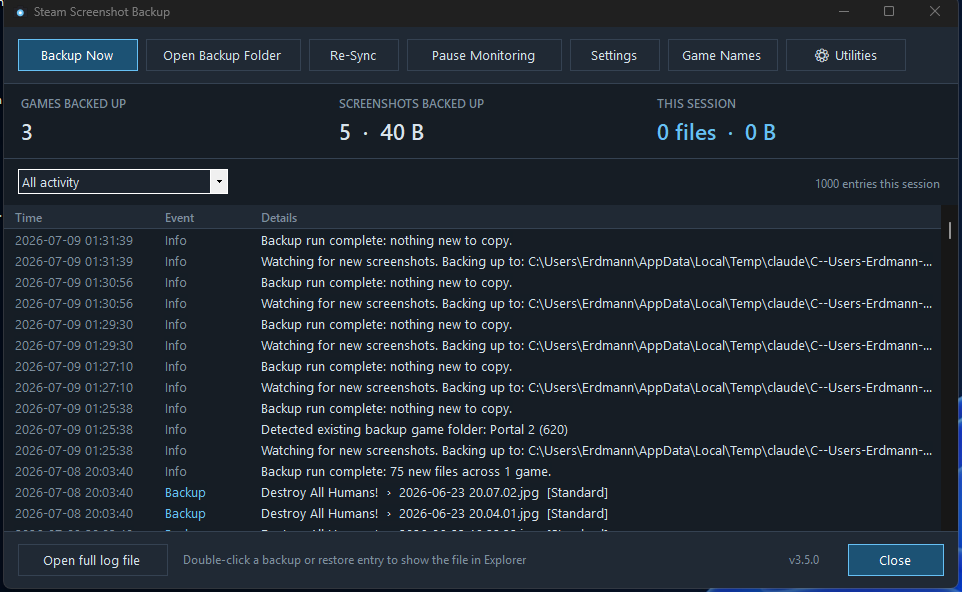
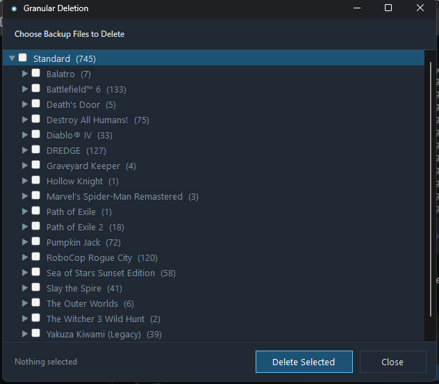
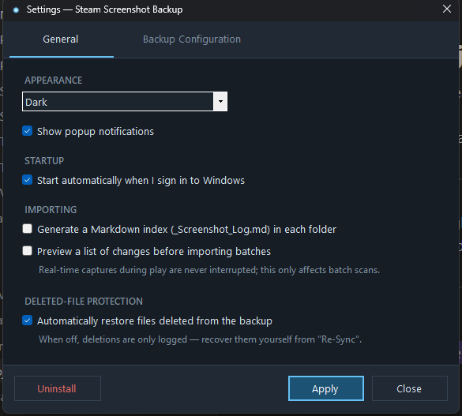
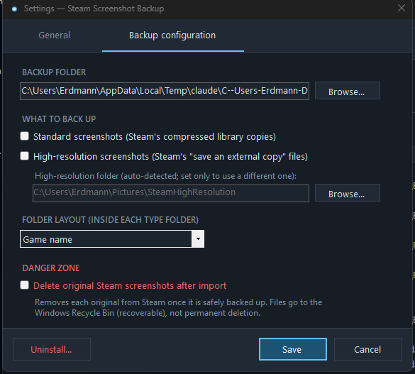
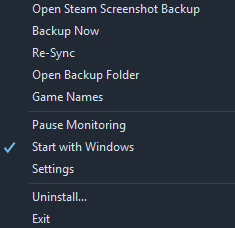
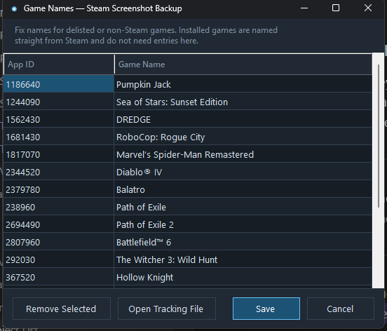
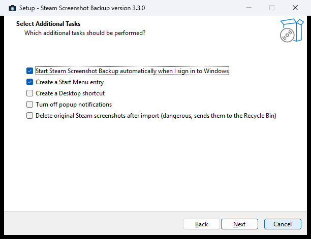
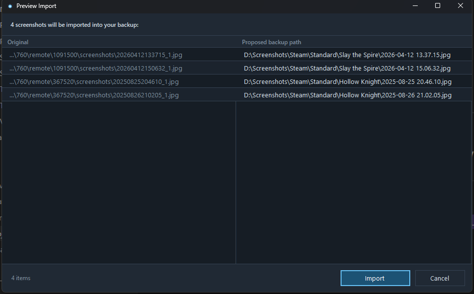

# Steam Screenshot Backup

Automatically consolidates every Steam screenshot — including the high-resolution
external copies — into one organized, searchable backup with **real game names**
and filenames you can actually read. It began as a way to rescue the screenshots
Steam locks away in appid-numbered folders — especially older ones taken before
Steam's "save an external copy" option existed — and grew to also organize the
high-resolution external copies that Steam otherwise dumps, unsorted, into a
single folder. Both stores are now watched and backed up continuously.

Steam buries screenshots in `userdata\<id>\760\remote\<appid>\screenshots` under
names like `20260706210532_1.jpg`, and it doesn't organize the uncompressed
"external copy" files either. This project turns all of that into:

```
Steam Screenshots/
├── Standard/
│   ├── Slay the Spire/
│   │   ├── 2026-04-12 13.37.15.jpg
│   │   └── 2026-04-12 15.06.32.jpg
│   └── Hollow Knight/
│       └── 2025-08-25 20.46.10.jpg
└── High Resolution/
    └── Slay the Spire/
        └── 2026-04-12 13.37.15.png
```

## Screenshots



*The main window — total games and screenshots backed up, per-session counters, and a live activity feed you can filter by backups, restores, deletions, warnings, or info.*



*Utilities → Delete specific files/folders — pick exactly which backup files to remove.*

<details>
<summary>More screenshots (Settings, Game Names, tray menu, installer, preview)</summary>

<p align="center">
  
  
</p>

*Settings — General (left) and Backup configuration (right).*

<p align="center">
  
  
</p>

*Left: the right-click tray menu. Right: Game Names — fix delisted or non-Steam games by hand.*



*The installer (dark to match the app) — pick startup, shortcut, and import options during setup.*



*Optional preview before a batch import or reorganization — see exactly what will happen, then Import or Cancel.*

</details>

## Key features

- **Real game names** — resolved automatically, including delisted and
  non-Steam games (which you can also rename by hand).
- **Both screenshot types** — Steam's compressed "Standard" copies and the
  uncompressed "High Resolution" external copies, both fully supported.
- **Real-time backup** — every screenshot is copied within about a second of Steam
  saving it, plus a catch-up scan at launch for anything taken while it was off.
- **Self-healing backup** — delete a file from the backup and it's restored
  automatically, or review and restore just what you want with **Re-Sync**.
- **Searchable metadata** — the game name is embedded in each backup file, so
  it shows up as searchable **Title**/**Tags** metadata in Explorer.
- **Every Steam account** on the machine is covered, and Steam's own files are
  never modified.

<details>
<summary>Additional features</summary>

- **Readable, sortable filenames** — `YYYY-MM-DD HH.MM.SS`, so sorting by name is
  sorting by capture time.
- **Custom folder layouts** — choose between `Game`, `Game\Year`, `Year\Game`
  and more; existing backups can be reorganized in place.
- **Markdown index** — optionally maintain a `_Screenshot_Log.md` in each folder
  that embeds every screenshot under per-day headers, ready to drop into Obsidian
  or any markdown vault.
- **Retroactive game-name tracking** — every backup run retries name resolution
  for games that couldn't be identified the first time.
- **Utilities menu** — one-click bulk cleanup plus a window for picking exactly
  which backup files to delete.
- **Preview before importing** — optionally review what will happen before
  batch imports and layout reorganizations.
- **Optional Steam cleanup** — turn on the (clearly-marked, dangerous) *Delete
  originals after import* setting and each original is removed from Steam once
  it's safely backed up, recoverable from the Recycle Bin.
- **Network-drive friendly** — if the destination drops, the app quietly queues
  work and resumes when it returns.
- **Dark and light themes** — or follow the Windows setting.
- **Statistics** — total games, screenshots, and data, plus per-session counters.

</details>

## Installation

### Installer (recommended)

1. Download `SteamScreenshotBackup-Setup-<version>.exe` from the
   [latest release](../../releases/latest).
2. Run it. Pick an install folder (defaults to Program Files) and choose whether
   to start with Windows, add Start Menu / Desktop shortcuts, turn off popup
   notifications, preview batches before importing, and (optionally, and flagged as
   dangerous) delete originals after import. The main window opens automatically
   when setup finishes.
3. On first launch, choose your backup folder and which screenshot types to back
   up. That's the entire setup.

**Updating to a new version?** Just download the latest installer and run it —
no need to uninstall first. It installs directly over your existing copy in
place and keeps your settings, game-name cache, and backed-up screenshots
untouched.

Uninstall any time from **Windows Settings → Apps** (or Control Panel →
Programs). The uninstaller removes the app, its settings, cache, and autostart
entry — your backed-up screenshots are never touched. The same uninstaller is
reachable from the app's Settings window.

### Portable

Prefer zero-install? Download `SteamScreenshotBackup.exe` (portable) from the
release, put it anywhere, and run it. Identical functionality; the in-app
Uninstall option cleans up after itself.

> **Windows SmartScreen:** the exe is unsigned, so the first run may show
> *"Windows protected your PC."* Click **More info → Run anyway** — or build from
> source (below) if you'd rather not trust a downloaded binary.

## Using the app

- **Left-click** the tray icon to toggle the main window: statistics, a live
  filterable activity feed, and every action as a button — **Backup Now**,
  **Open Backup Folder**, **Re-Sync**, **Pause Monitoring**, **Settings**,
  **Game Names**, **Utilities**. Double-click an entry to reveal the file in
  Explorer.
- **Right-click** the tray icon for the same actions in a quick menu, plus
  Start with Windows, Uninstall, and Exit.
- **Re-Sync** reviews everything in Steam that's missing from your backup,
  grouped by game, so you can restore just what you pick.
- **Settings** has two tabs: *General* (theme, notifications, startup, the
  Markdown index) and *Backup configuration* (folder, screenshot types,
  layout, and the danger zone).
- **Game Names** fixes delisted or non-Steam games by hand, or opens the
  tracking file directly.
- **Utilities** has one-click bulk cleanup and a window for picking exactly
  which files to delete.

### High-resolution screenshots

Steam saves uncompressed copies only when *"Save an external copy of my
screenshots"* is enabled (Steam Settings → In Game). The app reads Steam's
config to find that folder automatically — including retroactively importing
everything already in it. If it can't be auto-detected, set the folder yourself
in **Settings → High-resolution folder**. Screenshots taken before the option
was enabled exist only as compressed copies, which is exactly what the Standard
backup covers.

## PowerShell script

The `Backup-SteamScreenshots.ps1` script produces the same backup layout and
shares the same game-name cache as the app — use either, or both. Zero
dependencies beyond Windows PowerShell 5.1 (ships with Windows 10/11):

```powershell
.\Backup-SteamScreenshots.ps1 -Destination "D:\Backups\Steam Screenshots" -Types Both
```

| Parameter | Values | Default |
|---|---|---|
| `-Destination` | any folder | `%USERPROFILE%\Pictures\Steam Screenshots` |
| `-Types` | `Standard`, `HighRes`, `Both` | `Both` |
| `-FolderTemplate` | `{game}`, `{yyyy}\{game}`, … | `{game}` |
| `-HighResPath` | manual external-copy folder (if not auto-detected) | *(auto only)* |

Runs are incremental, so scheduling is safe:

```
schtasks /create /tn "SteamScreenshotBackup" /tr "powershell -ExecutionPolicy Bypass -WindowStyle Hidden -File C:\path\to\Backup-SteamScreenshots.ps1" /sc daily /st 03:00
```

Note: metadata tagging is a tray-app feature; the script copies files verbatim.
The two tools recognize each other's copies either way.

## Delisted games

Games removed from the Steam store can't be resolved via the API. Fix them in
the app under **Game Names**, or add entries to
`%LOCALAPPDATA%\SteamScreenshotBackup\appnames.json` by hand:

```json
{ "1681430": "Some Delisted Game" }
```

## Resource usage and performance

Designed to be invisible day-to-day: idle cost is near zero (native file-system
watching, not polling), copies preserve timestamps without re-encoding, game
names are cached forever, logs are size-capped, and a dropped network
destination is queued and retried quietly instead of erroring.

## Building from source

Requires the .NET 8 SDK (`winget install Microsoft.DotNet.SDK.8`); the installer
additionally needs Inno Setup 6 (`winget install JRSoftware.InnoSetup`):

```powershell
.\build.ps1     # produces dist\portable and dist\installer
```

For a quick development run: `dotnet run` inside `app\`.

## Repository layout

```
Backup-SteamScreenshots.ps1   Script version (same layout, same cache)
app/                          Tray app (C# / .NET 8 WinForms)
installer/setup.iss           Inno Setup installer script
build.ps1                     One-command release build
```

## Limitations

- Windows only.
- High-resolution backups require Steam's *"Save an external copy"* option to be
  enabled; Steam does not create uncompressed copies retroactively.

## Transparency

This tool watches your Steam folders and copies — and, if you opt in, deletes —
your personal screenshots. Because it touches your own files, **a core goal of the
project is to be completely transparent about what it does behind the scenes.**

- Everything it does is visible: the main window's activity feed and the on-disk
  `app.log` record every backup, restore, deletion, warning, and error as it happens.
- It is **non-destructive by default.** Steam's own files are never modified or
  removed unless you explicitly enable the dangerous *Delete originals after import*
  option — and even then, deletions go to the **Windows Recycle Bin**, never a
  permanent wipe.
- Deleting backups — whether from turning a screenshot type off, the Utilities
  menu's bulk actions, or the targeted deletion window — always goes to the
  Recycle Bin, and always shows the exact file count and total size before you
  confirm.
- No telemetry, no accounts, no network calls except optional Steam store lookups
  to resolve game names (cached locally, one lookup per game, ever).
- The full source is here. Nothing about how your files are handled is hidden — if
  the code and the documentation ever disagree, that's a bug worth reporting.

## Disclaimer

This project was generated with [Claude Code](https://claude.com/claude-code)
(Anthropic's AI coding tool) under human direction and testing. Review the source
before use if that matters to you — it's all here.

## License

MIT — see [LICENSE](LICENSE).
