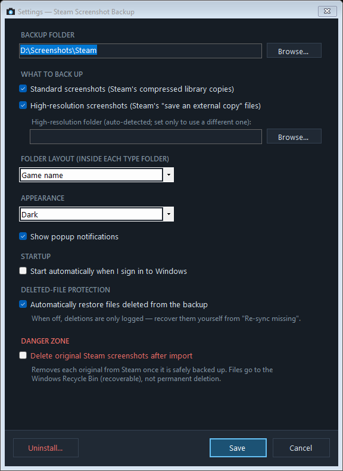

# Steam Screenshot Backup

Automatically consolidates every Steam screenshot — including the high-resolution
external copies — into one organized, searchable backup with **real game names**
and filenames you can actually read. It began as a way to rescue the screenshots
Steam locks away in appid-numbered folders — especially older ones taken before
Steam's "save an external copy" option existed — and grew to also organize the
high-resolution external copies that Steam otherwise dumps, unsorted, into a
single folder. Both stores are now watched and backed up continuously.

Steam buries screenshots in `userdata\<id>\760\remote\<appid>\screenshots` under
names like `20260706210532_1.jpg`, and it doesn't organize the uncompressed
"external copy" files either. This project turns all of that into:

```
Steam Screenshots/
├── Standard/
│   ├── Slay the Spire/
│   │   ├── 2026-04-12 13.37.15.jpg
│   │   └── 2026-04-12 15.06.32.jpg
│   └── Hollow Knight/
│       └── 2025-08-25 20.46.10.jpg
└── High Resolution/
    └── Slay the Spire/
        └── 2026-04-12 13.37.15.png
```

## Screenshots


*The main window — total games and screenshots backed up, per-session counters, and a live activity feed you can filter by backups, restores, deletions, warnings, or info.*

<p align="center">
  
  
</p>

*Left: Settings — backup folder, screenshot types, a manual high-resolution folder, folder layout, theme, popup notifications, startup, deleted-file protection, and the dangerous "delete originals after import" option. Right: the right-click tray menu (left-clicking the icon toggles the window).*


*The installer lets you choose startup, shortcuts, popup notifications, and (dangerous) delete-originals-after-import; the main window opens automatically when setup finishes.*

## Key features

- **Real game names** — resolved from local Steam manifests, the Steam store API
  (cached forever), and even `shortcuts.vdf` for non-Steam games. Delisted games
  can be named by hand in a built-in editor.
- **Both screenshot types** — Steam's compressed library copies ("Standard") and
  the uncompressed external copies ("High Resolution"), each with full parity:
  live watching, retroactive import of existing files, and deletion restore.
- **Readable, sortable filenames** — `YYYY-MM-DD HH.MM.SS`, so sorting by name is
  sorting by capture time.
- **Real-time backup** — every screenshot is copied within about a second of Steam
  saving it. A catch-up scan at launch covers anything taken while the app was off.
- **Self-healing backup** — delete a file (or a whole game folder) from the backup
  and the app notices and logs it. With automatic restore on (the default),
  anything still in Steam is copied straight back. Prefer to stay in control? Turn
  it off and use **Re-sync missing** to review everything in Steam that isn't in
  your backup — grouped by game — and restore only what you pick.
- **Searchable metadata** — the game name is injected into each backup copy as
  standard Windows-readable properties (JPEG EXIF Title/Subject, PNG XMP) without
  re-encoding a single pixel or changing the file's timestamps, so it shows up as
  the file's **Title**/**Tags** in Explorer and is searchable in indexed locations.
- **Custom folder layouts** — choose between `Game`, `Game\Year`, `Year\Game` and
  more; existing backups can be reorganized in place. Handy for markdown journals
  and personal knowledge bases.
- **Optional Steam cleanup** — turn on the (clearly-marked, dangerous) *Delete
  originals after import* setting and each original is removed from Steam once it's
  safely backed up. Deleted files go to the **Windows Recycle Bin**, so they stay
  recoverable.
- **Network-drive friendly** — if the destination is a NAS share that drops, the
  app quietly queues work and resumes when it returns. No error spam.
- **Dark and light themes** — or follow the Windows setting.
- **Statistics** — total games, total screenshots and data, plus per-session counters,
  right in the main window.
- **Every Steam account** on the machine is covered, and Steam's own files are
  never modified.

## Installation

### Installer (recommended)

1. Download `SteamScreenshotBackup-Setup-<version>.exe` from the
   [latest release](../../releases/latest).
2. Run it. Pick an install folder (defaults to Program Files) and choose whether
   to start with Windows, add Start Menu / Desktop shortcuts, turn off popup
   notifications, and (optionally, and flagged as dangerous) delete originals after
   import. The main window opens automatically when setup finishes.
3. On first launch, choose your backup folder and which screenshot types to back
   up. That's the entire setup.

Uninstall any time from **Windows Settings → Apps** (or Control Panel →
Programs). The uninstaller removes the app, its settings, cache, and autostart
entry — your backed-up screenshots are never touched. The same uninstaller is
reachable from the app's Settings window.

### Portable

Prefer zero-install? Download `SteamScreenshotBackup.exe` (portable) from the
release, put it anywhere, and run it. Identical functionality; the in-app
Uninstall option cleans up after itself.

> **Windows SmartScreen:** the exe is unsigned, so the first run may show
> *"Windows protected your PC."* Click **More info → Run anyway** — or build from
> source (below) if you'd rather not trust a downloaded binary.

## Using the app

- **Left-click** the tray icon to toggle the main window (show or hide it):
  statistics, a live activity feed (backups, restores, deletions, warnings — all
  filterable), and every action as a button. Double-click a backup entry to reveal
  the file in Explorer. The current version is shown in the window's bottom corner.
- **Right-click** the tray icon for the quick menu: Open, Back up now, Re-sync
  missing screenshots, Open backup folder, Pause watching, Start with Windows,
  Settings, Uninstall, Exit.
- **Re-sync missing** lists every screenshot in Steam that isn't in your backup,
  grouped by game, with checkboxes so you can restore all of them or just a few.
- **Settings** covers the backup folder (with optional migration of existing
  files), screenshot types (turning one off offers to Recycle-Bin its existing
  backups), a manual high-resolution folder for when it can't be auto-detected,
  folder layout (with optional in-place reorganization), theme, popup
  notifications, autostart, whether deleted backup files are restored
  automatically, and a dangerous *Delete originals after import* option (with a
  double confirmation and an offer to apply it to already-imported screenshots).
- **Game names** lets you fix delisted or non-Steam games without touching any
  JSON by hand.

### High-resolution screenshots

Steam saves uncompressed copies only when *"Save an external copy of my
screenshots"* is enabled (Steam Settings → In Game). The app reads Steam's
config to find that folder automatically — including retroactively importing
everything already in it. If it can't be auto-detected, set the folder yourself
in **Settings → High-resolution folder**. Screenshots taken before the option
was enabled exist only as compressed copies, which is exactly what the Standard
backup covers.

## PowerShell script

The `Backup-SteamScreenshots.ps1` script produces the same backup layout and
shares the same game-name cache as the app — use either, or both. Zero
dependencies beyond Windows PowerShell 5.1 (ships with Windows 10/11):

```powershell
.\Backup-SteamScreenshots.ps1 -Destination "D:\Backups\Steam Screenshots" -Types Both
```

| Parameter | Values | Default |
|---|---|---|
| `-Destination` | any folder | `%USERPROFILE%\Pictures\Steam Screenshots` |
| `-Types` | `Standard`, `HighRes`, `Both` | `Both` |
| `-FolderTemplate` | `{game}`, `{yyyy}\{game}`, … | `{game}` |
| `-HighResPath` | manual external-copy folder (if not auto-detected) | *(auto only)* |

Runs are incremental, so scheduling is safe:

```
schtasks /create /tn "SteamScreenshotBackup" /tr "powershell -ExecutionPolicy Bypass -WindowStyle Hidden -File C:\path\to\Backup-SteamScreenshots.ps1" /sc daily /st 03:00
```

Note: metadata tagging is a tray-app feature; the script copies files verbatim.
The two tools recognize each other's copies either way.

## Delisted games

Games removed from the Steam store can't be resolved via the API. Fix them in
the app under **Game names**, or add entries to
`%LOCALAPPDATA%\SteamScreenshotBackup\appnames.json` by hand:

```json
{ "1681430": "Some Delisted Game" }
```

## Resource usage and performance

The app is designed to be invisible in day-to-day use:

- **Idle cost is near zero.** Watching is done with native file-system change
  notifications (`FileSystemWatcher`), not polling — no disk scanning while idle.
- **Copies are streamed by the OS** and preserve original timestamps; metadata is
  inserted losslessly (a few hundred bytes) without re-encoding image data.
- **Name lookups are cached forever** in `appnames.json`; each game is resolved
  once, ever, across both tools. Failed lookups are not retried within a session.
- **Logs are rotated** at ~1 MB with three retained archives, so disk usage stays
  capped no matter how long the app runs.
- **Offline destinations don't spin.** When a network destination drops, the app
  checks every 20 seconds and queues work instead of retrying copies in a loop.
- Memory footprint is a normal .NET tray app (tens of MB); CPU is effectively 0%
  except during a scan or copy.

## Building from source

Requires the .NET 8 SDK (`winget install Microsoft.DotNet.SDK.8`); the installer
additionally needs Inno Setup 6 (`winget install JRSoftware.InnoSetup`):

```powershell
.\build.ps1     # produces dist\portable and dist\installer
```

For a quick development run: `dotnet run` inside `app\`.

## Repository layout

```
Backup-SteamScreenshots.ps1   Script version (same layout, same cache)
app/                          Tray app (C# / .NET 8 WinForms)
installer/setup.iss           Inno Setup installer script
build.ps1                     One-command release build
```

## Limitations

- Windows only.
- High-resolution backups require Steam's *"Save an external copy"* option to be
  enabled; Steam does not create uncompressed copies retroactively.

## Transparency

This tool watches your Steam folders and copies — and, if you opt in, deletes —
your personal screenshots. Because it touches your own files, **a core goal of the
project is to be completely transparent about what it does behind the scenes.**

- Everything it does is visible: the main window's activity feed and the on-disk
  `app.log` record every backup, restore, deletion, warning, and error as it happens.
- It is **non-destructive by default.** Steam's own files are never modified or
  removed unless you explicitly enable the dangerous *Delete originals after import*
  option — and even then, deletions go to the **Windows Recycle Bin**, never a
  permanent wipe.
- Deleting backups (e.g. when you turn a screenshot type off) also goes to the
  Recycle Bin, and is always something you confirm first.
- No telemetry, no accounts, no network calls except optional Steam store lookups
  to resolve game names (cached locally, one lookup per game, ever).
- The full source is here. Nothing about how your files are handled is hidden — if
  the code and the documentation ever disagree, that's a bug worth reporting.

## Disclaimer

This project was generated with [Claude Code](https://claude.com/claude-code)
(Anthropic's AI coding tool) under human direction and testing. Review the source
before use if that matters to you — it's all here.

## License

MIT — see [LICENSE](LICENSE).
